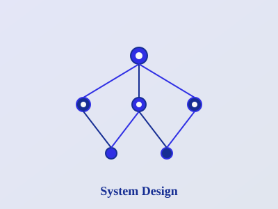
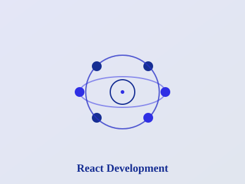

# TechLearn - React, Docker, Jenkins, and EKS

TechLearn is a recruiter-friendly internal learning platform built with React and Vite, packaged with Docker, and prepared for Kubernetes deployment on AWS EKS. The app presents learning tracks, course cards, category filtering, course details, and a clean navigation flow that is easy to demo in interviews.

## What This Project Shows

- React 19 with modern component and context patterns
- Vite-based local development and production builds
- Docker multi-stage image build with Nginx runtime
- Kubernetes deployment and LoadBalancer service
- EKS-ready app packaging for cloud deployment
- Clear UI structure that is easy to explain to recruiters

## Visual Preview






## App Structure

```text
src/
├── App.jsx
├── main.jsx
├── App.css
├── index.css
├── components/
│   ├── Navbar.jsx
│   ├── Hero.jsx
│   ├── CourseCard.jsx
│   ├── CourseDetails.jsx
│   ├── CategoryStrip.jsx
│   ├── ProgressBar.jsx
│   ├── SectionHeader.jsx
│   └── StatusPanel.jsx
├── context/
│   ├── CoursePlatformProvider.jsx
│   ├── coursePlatformContext.js
│   └── useCoursePlatform.js
├── pages/
│   ├── HomePage.jsx
│   ├── CoursesPage.jsx
│   ├── CourseDetailsPage.jsx
│   └── AboutPage.jsx
├── services/
│   ├── courseService.js
│   └── mockCourses.js
└── utils/
    ├── appConfig.js
    ├── date.js
    └── formatters.js
```

## How It Works

```mermaid
flowchart LR
  Developer --> GitHub[GitHub Repository]
  GitHub --> Jenkins[Jenkins Pipeline]
  Jenkins --> Build[Build React App]
  Build --> Docker[Create Docker Image]
  Docker --> Registry[Push to Docker Hub]
  Registry --> EKS[AWS EKS Cluster]
  EKS --> Service[LoadBalancer Service]
  Service --> Users[Users Access the App]
```



## Local Development

```bash
npm install
npm run dev
```

Useful local commands:

```bash
npm run build
npm run preview
npm run lint
```

## Docker Commands

```bash
docker build -t techlearn-app:v1 .
docker run -d -p 8080:8080 techlearn-app:v1
docker tag techlearn-app:v1 yourdockerhub/techlearn-app:v1
docker push yourdockerhub/techlearn-app:v1
```

## Kubernetes And EKS Commands

```bash
eksctl create cluster ^
  --name techlearn-cluster ^
  --region ap-southeast-2 ^
  --nodegroup-name worker-nodes ^
  --node-type t3.small ^
  --nodes 2 ^
  --managed

kubectl get nodes
kubectl apply -f k8s/deployment.yaml
kubectl apply -f k8s/service.yaml
kubectl get pods
kubectl get svc
```

## Project Layout For Recruiters

- `src/components` contains reusable UI blocks for the course platform.
- `src/context` holds state management for page navigation, filtering, and enrollment.
- `src/pages` keeps the route-level views organized and easy to demo.
- `src/services` isolates the course data loading logic.
- `public/images` stores visual assets used in the README and app branding.
- `k8s` contains the deployment and service manifests for cluster rollout.

## Deployment Notes

- The container listens on port `8080`.
- The Kubernetes service exposes the app on port `80` and forwards to the container port `8080`.
- The Dockerfile uses a multi-stage build so the runtime image stays small and production-ready.

## Good Demo Talking Points

- Clean internal learning UI with featured courses and category filtering.
- Context-driven state management without unnecessary complexity.
- Ready for Docker, Kubernetes, Jenkins, and AWS EKS deployment workflows.
- Easy to present in an interview because the folder structure maps directly to product features.

## Covered Topics

- Git and GitHub
- Jenkins CI/CD
- Docker and Docker Hub
- Kubernetes manifests and services
- AWS EKS deployment
- React component architecture
- Production build and runtime serving
